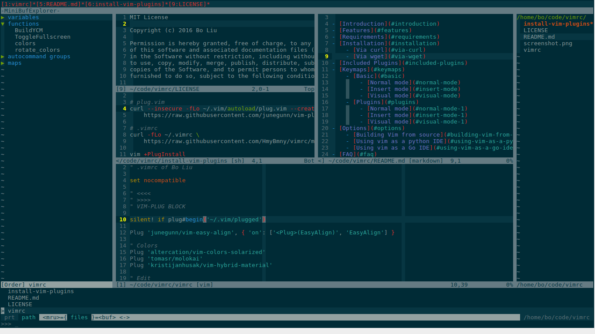

C/C++ IDE
===============================================

- [Introduction](#introduction)
- [Features](#features)
- [Requirements](#requirements)
- [Installation](#installation)
    - [Via curl](#via-curl)
    - [Via wget](#via-wget)
- [Included Plugins](#included-plugins)
- [Keymaps](#keymaps)
    - [Basic](#basic)
        - [Normal mode](#normal-mode)
        - [Insert mode](#insert-mode)
        - [Visual mode](#visual-mode)
    - [Plugins](#plugins)
        - [Normal mode](#normal-mode-1)
        - [Insert mode](#insert-mode-1)
        - [Visual mode](#visual-mode-1)
- [Options](#options)
    - [Building Vim from source](#building-vim-from-source)
    - [Using vim as a python IDE](#using-vim-as-a-python-ide)
    - [Using vim as a Go IDE](#using-vim-as-a-go-ide)
- [FAQ](#faq)
- [Contact](#contact)
- [License](#license)

Introduction
-----

Building vim editor in Linux into an effective C/C++ programming IDE, supporting [YouCompleteMe](https://github.com/Valloric/YouCompleteMe) as a code-completion engine.

Features
-----

- Automatic download the latest version of libclang and compile the ycm_core library that YCM needs
- One-step install
- Supported all GNU/Linux
- On-demand loading for faster startup time
- Semantic auto-completion
- Syntax checking 
- Syntax highlighting for C++11/14
- Preservation of historical records
- Instantly preview markdown files
- More

Requirements
-----

- `at least 7.3.598` and `Python 2` or `Python 3` scripting is supported
- `npm -g install instant-markdown-d` For plugin vim-instant-markdown
- `xdg-utils` For plugin vim-instant-markdown
- `nodejs-legacy` For Debian-based systems
- `wmctrl` Fullscreen needs
- `cmake` Compile the ycm_core library
- `ctags` For plugin tarbar

Installation
-----

### Via curl

    curl -o - https://raw.githubusercontent.com/HmyBmny/vimrc/master/install-vim-plugins | sh

### Via wget

    wget -O - https://raw.githubusercontent.com/HmyBmny/vimrc/master/install-vim-plugins | sh

Included Plugins
-----

I think you should read the docs of these plugins and .vimrc to use them efficiently.

- [vim-plug](https://github.com/junegunn/vim-plug): Minimalist Vim Plugin Manager
- [vim-easy-align](https://github.com/junegunn/vim-easy-align): A Vim alignment plugin
- [vim-colors-solarized](https://github.com/altercation/vim-colors-solarized): precision colorscheme for the vim text editor
- [vim-tomorrow-theme](https://github.com/chriskempson/vim-tomorrow-theme): Tomorrow Theme for Vim
- [ultisnips](https://github.com/SirVer/ultisnips): The ultimate snippet solution for Vim
- [vim-multiple-cursors](https://github.com/terryma/vim-multiple-cursors): True Sublime Text style multiple selections for Vim
- [vim-move](https://github.com/matze/vim-move): Plugin to move lines and selections up and down
- [YankRing.vim](https://github.com/vim-scripts/YankRing.vim): Maintains a history of previous yanks, changes and deletes
- [auto-pairs](https://github.com/jiangmiao/auto-pairs): Vim plugin, insert or delete brackets, parens, quotes in pair 
- [vim-operator-user](https://github.com/kana/vim-operator-user): Vim plugin: Define your own operator easily
- [vim-clang-format](https://github.com/rhysd/vim-clang-format): Vim plugin for clang-format, a formatter for C, C++, Obj-C, Java, JavaScript and TypeScript
- [wildfire.vim](https://github.com/gcmt/wildfire.vim): Smart selection of the closest text object
- [vim-indent-guides](https://github.com/nathanaelkane/vim-indent-guides): A Vim plugin for visually displaying indent levels in code
- [vim-fswitch](https://github.com/derekwyatt/vim-fswitch): Vim plug for switching between companion source files (e.g. ".h" and ".cpp")
- [vim-protodef](https://github.com/derekwyatt/vim-protodef): Vim plugin for pulling in C++ function prototypes into implementation files
- [nerdcommenter](https://github.com/scrooloose/nerdcommenter): Vim plugin for intensely orgasmic commenting
- [nerdtree](https://github.com/scrooloose/nerdtree): A tree explorer plugin for vim
- [tagbar](https://github.com/majutsushi/tagbar): Vim plugin that displays tags in a window, ordered by scope
- [vim-polyglot](https://github.com/sheerun/vim-polyglot): A solid language pack for Vim
- [syntastic](https://github.com/scrooloose/syntastic): Syntax checking hacks for vim
- [minibufexpl.vim](https://github.com/fholgado/minibufexpl.vim): Elegant buffer explorer - takes very little screen space
- [gundo.vim](https://github.com/sjl/gundo.vim): Gundo.vim is Vim plugin to visualize your Vim undo tree
- [ctrlsf.vim](https://github.com/dyng/ctrlsf.vim): An ack.vim alternative mimics Ctrl-Shift-F on Sublime Text 2
- [ctrlp.vim](https://github.com/kien/ctrlp.vim): Fuzzy file, buffer, mru, tag, etc finder
- [vim-instant-markdown](https://github.com/suan/vim-instant-markdown): Instant Markdown previews from VIm
- [YouCompleteMe](https://github.com/Valloric/YouCompleteMe): A code-completion engine for Vim

Keymaps
-----

The `<leader>` key is `;`

### Basic

#### Normal mode

- `;w` Write (save) the file, but don't exit
- `;q` Quit
- `;Q` Quit and throw away changes
- `;p` Paste
- `;hw` Jump to the left window
- `;jw` Jump to the down window
- `;kw` Jump to the up window
- `;lw` Jump to the right window
- `<tab>` Jump to the next window
- `<S-tab>` Jump to the previous window
- `]q` Jump to next record/match in quickfix list
- `[q` Jump to previous record/match in quickfix list
- `<F8>` Change color scheme
- `<F11>` Fullscreen

#### Insert mode

- `<C-s>` Write (save) the file, but don't exit
- `<C-h>` Move left
- `<C-j>` Move down
- `<C-k>` Move up
- `<C-l>` move right
- `<F8>` Change color scheme
- `<F11>` Fullscreen

#### Visual mode

- `;y` Copy

### Plugins

#### Normal mode

- `;fs` Switch between companion source files (e.g. ".h" and ".cpp")
- `]b` Jump to the next buffer 
- `[b` Jump to the previous buffer 
- `;ud` Toggle Gundo visible 
- `<C-f>` Search and split a new window to show search result
- `<C-p>` Open ctrlp window (alternative :CtrlP)
- `;md` Launch the preview window for current markdown file
- `;jc` Go to declaration
- `;jd` Go to definition
- `<F2>` Toogle Tagbar visible
- `<F3>` Toogle NERD-Tree visible
- `<F4>` Toogle minibufexpl visble
- `<F9>` Show history of previous yanks, changes and deletes
- `<F12>` Format your C family code

#### Insert mode

- `<F2>` Toogle Tagbar visible
- `<F3>` Toogle NERD-Tree visible
- `<F4>` Toogle minibufexpl visble
- `<F9>` Show history of previous yanks, changes and deletes
- `<F12>` Format your C family code

#### Visual mode

- `<C-k>` Move current line/selections up
- `<C-j>` Move current line/selections down

### Options

#### Building Vim from source

- Install all the following libraries

    `ruby-devel` `python-devel` `python3-devel` `perl-devel` `lua-devel` `ncurses-devel` `libX11-devel` `gtk2-devel` `xorg-x11-devel`

- Remove vim if you have it already
- Building Vim from source

    - Add/remove the flags above to fit your setup. For example, you can leave out enable-luainterp if you don't plan on writing any Lua.

            cd ~
            git clone https://github.com/vim/vim.git
            cd vim
            ./configure --with-features=huge \
                        --enable-multibyte \
                        --enable-rubyinterp \
                        --enable-pythoninterp \
                        --with-python-config-dir=/usr/lib/python2.7/config \
                        --enable-perlinterp \
                        --enable-luainterp \
                        --enable-gui=gtk2 --enable-cscope --prefix=/usr
            make
            sudo make install

    - Type the following in Vim: `:echo has('python')`. If the output is 1, then the version of Vim with Python support. If it's 0, then get a version of Vim with Python support.

#### Using vim as a python IDE

Add the following line to your .vimrc.

    Plug 'klen/python-mode', { 'for': 'python' }

Install Plugin `vim +PlugInstall +qall`

#### Using vim as a Go IDE

Add the following line to your .vimrc.

    Plug 'fatih/vim-go', { 'for': 'go' }

Install Plugin `vim +PlugInstall +qall`

FAQ
-----

### Can't build vim correctly

This wiki [Building-Vim-from-source](https://github.com/Valloric/YouCompleteMe/wiki/Building-Vim-from-source) may be helpful for you. 

Contact
-----

If I have any mistakes in grammar or vocabulary, please point out. Thanks!

If you have feature suggestions, please open [issues](#https://github.com/HmyBmny/vimrc/issues) or [pull requests](#https://github.com/HmyBmny/vimrc/pulls).

License
-----

MIT
